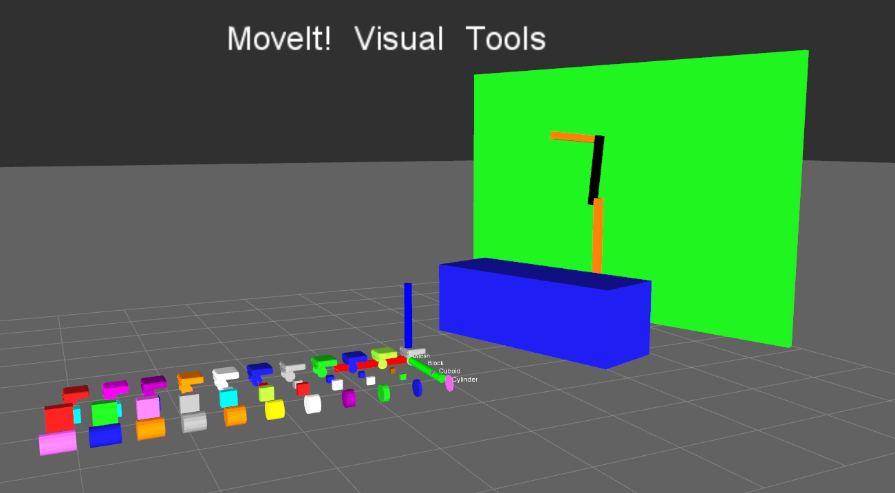
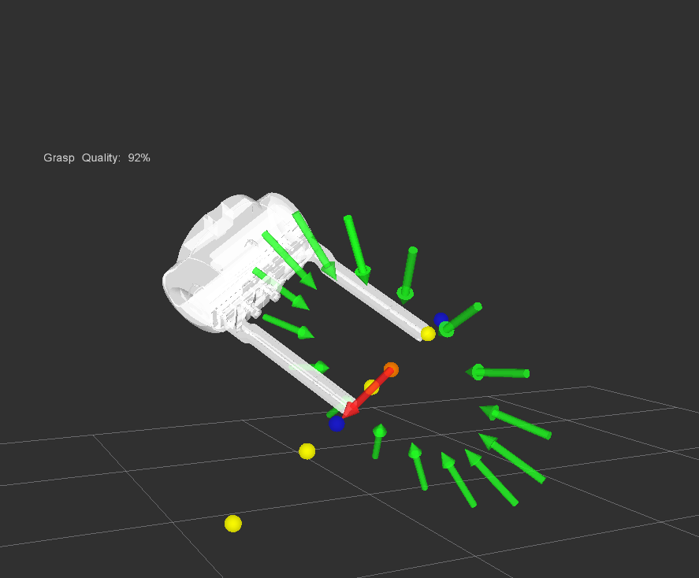

# MoveIt Visual Tools

Helper functions for displaying and debugging MoveIt data in Rviz via published markers, trajectories, and MoveIt collision objects. It is sometimes hard to understand everything that is going on internally with MoveIt, but using these quick convenience functions allows one to easily visualize their code. This package is built in top of [rviz_visual_tools](https://github.com/PickNikRobotics/rviz_visual_tools) and all those features are included via class inheritance.

This package helps you visualize:

 - Basic Rviz geometric shapes
 - MoveIt collision objects
 - MoveIt and ROS trajectories
 - Robot states
 - End effectors
 - Interactive markers to move robot arms using IK from remote applications


This open source project was developed at [PickNik Robotics](https://picknik.ai/). Need professional ROS development and consulting? Contact us at projects@picknik.ai for a free consultation.

## Status:

### ROS:
- [](https://github.com/ros-planning/moveit_visual_tools/actions/workflows/build_and_test.yaml?query=branch%3Amaster) [](https://github.com/ros-planning/moveit_visual_tools/actions/workflows/format.yaml?query=branch%3Amaster) Github Actions
- [](http://build.ros.org/job/Nsrc_uF__moveit_visual_tools__ubuntu_focal__source/) ROS Buildfarm - AMD64 Focal Source Build - Ubuntu 20.04 LTS
- [](http://build.ros.org/job/Ndev__moveit_visual_tools__ubuntu_focal_amd64/) ROS Buildfarm - AMD64 Focal Devel Build - Ubuntu 20.04 LTS

### ROS2:
- [](https://github.com/ros-planning/moveit_visual_tools/actions/workflows/build_and_test.yaml?query=branch%3Aros2) GHA: Build and Test
- [](https://github.com/ros-planning/moveit_visual_tools/actions/workflows/format.yaml?query=branch%3Aros2) GHA: Formatting





## ROS2 Install

### Install From Source


Install moveit2 following the instructions [here](https://moveit.ros.org/install-moveit2/source/). After sourcing the moveit workspace clone this repository into a colcon workspace, import and install dependencies and build:

    source ~/ws_moveit/install/setup.bash
    cd $COLCON_WS/src
    git clone -b ros2 https://github.com/ros-planning/moveit_visual_tools
    vcs import < moveit_visual_tools/moveit_visual_tools.repos
    rosdep install -r --from-paths . --ignore-src --rosdistro foxy -y
    cd $COLCON_WS
    colcon build --event-handlers desktop_notification- status- --cmake-args -DCMAKE_BUILD_TYPE=Release

## Quick Start Demo

To run some demos displaying robot states and collision objects:

    ros2 launch moveit_visual_tools demo_rviz.launch.py

## Code API

See [VisualTools Class Reference](http://docs.ros.org/kinetic/api/moveit_visual_tools/html/classmoveit__visual__tools_1_1MoveItVisualTools.html)

## Usage

We'll assume you will be using these helper functions within a class.

### Initialize

Add to your includes:
```
#include <moveit_visual_tools/moveit_visual_tools.h>
```

Add to your class's member variables:
```
// For visualizing things in rviz
moveit_visual_tools::MoveItVisualToolsPtr visual_tools_;
```

In your class' constructor add:
```
visual_tools_ = std::make_shared<moveit_visual_tools::MoveItVisualTools>(node_, "world", "/moveit_visual_tools");
```

### Collision Object Functions

Helpers for adding and removing objects from the MoveIt planning scene. CO stands for Collision Object and ACO stands for Active Collision Object.

 - cleanupCO
 - cleanupACO
 - attachCO
 - publishCollisionBlock
 - publishCollisionCylinder
 - publishCollisionTree
 - publishCollisionTable
 - publishCollisionWall

And more...

### Animate Trajectories

Higher level robot and trajectory functions

 - publishTrajectoryPath
 - publishTrajectoryPoint
 - publishRobotState
 - publishAnimatedGrasps
 - publishIKSolutions

## Show parts of a robot

These functions are a little more complicated

 - publishEEMarkers

## Parent Class

This class is built on top of [rviz_visual_tools](https://github.com/PickNikRobotics/rviz_visual_tools) so all features and documentation for that package apply here as well.

## Developers Notes

Useful notes for anyone wanting to dig in deeper:

 -  All poses are published with respect to the world frame e.g. /world, /odom, or maybe /base
 -  All publish() ROS topics should be followed by a ``rclcpp::spin_some(node);`` but no sleep
 -  Do not want to load any features/publishers until they are actually needed since this library contains so many components

## Linting (pre-commit)

pre-commit is a tool that is used in moveit2_tutorials to check and apply style guidelines automatically. To install pre-commit into your system:

    pip3 install pre-commit

Then under moveit2_tutorials directory install the git hooks like this:

    cd $COLCON_WS/src/moveit2_tutorials && pre-commit install

With this pre-commit will automatically run and check a list of styling including clang-format, end of files and trailing whitespaces whenever you run `git commit`. To run pre-commit any time other than `git commit`:

    cd $COLCON_WS/src/moveit2_tutorials && pre-commit run -a

## Contribute

Please send PRs for new helper functions, fixes, etc!
